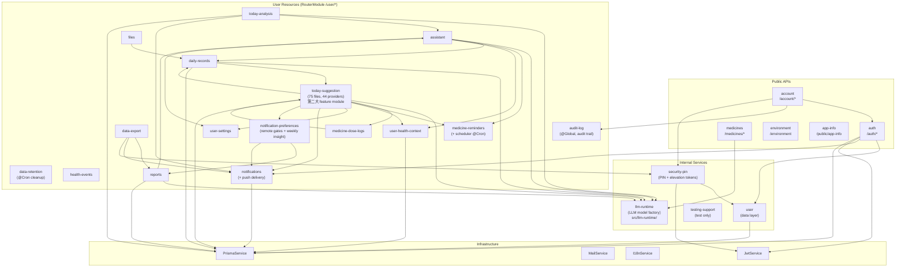
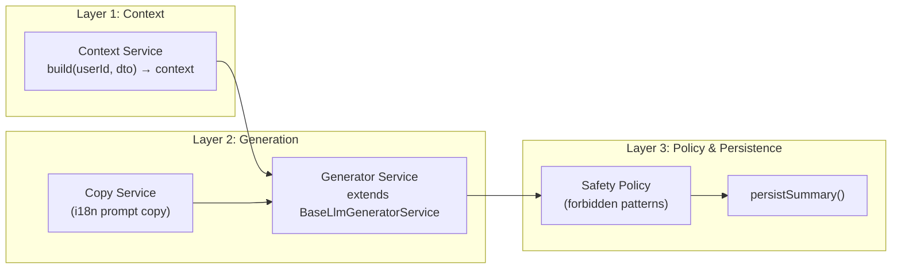
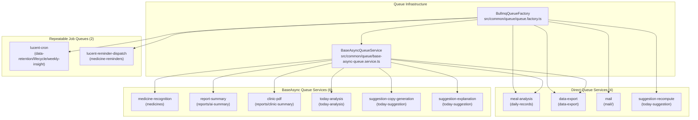

# Lucent Architecture

## HTTP Boundary (2026-08-22)

The target HTTP boundary separates representations: successful resources are returned directly,
while ordinary 4xx/5xx responses use RFC 9457 `application/problem+json`. The global exception
filter now owns the safe Problem Details shape and trace correlation. All controller success
responses and OpenAPI response schemas now use direct resources; no global success interceptor or
HTTP success envelope remains.

## Module Dependency Graph



## Cross-Module Data Access (Reader Ports)

Cross-module data access is governed by [ADR-0009](adr/0009-cross-module-data-access.md).
The core principle: owning module defines the read contract, consumers depend on the
abstract port — never on Prisma query DSL directly.

### Provider-side Reader Ports

These abstract classes are co-located with their concrete repository implementation,
bound via `useExisting` (single instance), and exported through the module root barrel
when external consumers exist.

| Port                         | Owning Module      | File                                      | Exported | Consumers                                                                   |
| ---------------------------- | ------------------ | ----------------------------------------- | -------- | --------------------------------------------------------------------------- |
| `DailyRecordReaderPort`      | daily-records      | `repositories/daily-record.repository.ts` | Yes      | today-analysis, today-suggestion (collectors + baseline), reports/dashboard |
| `MedicineDoseLogReaderPort`  | medicine-dose-logs | `repositories/dose-log.repository.ts`     | Yes      | today-analysis, today-suggestion (collectors), reports/dashboard            |
| `MedicineReminderReaderPort` | medicine-reminders | `repositories/reminder.repository.ts`     | Yes      | today-analysis                                                              |

Each reader returns **fact DTOs** (plain data shapes), not Prisma `WhereInput` or model
objects. Sorting and soft-delete filtering (`nonDeleted`) are baked into the reader
implementation, so consumers never duplicate these concerns.

### Sparse metric projections

Sparse health observations use the shared `ObservedMetric<T>` contract from
`src/common/types/observed-metric.types.ts`. A missing value is represented by
`value: null` and `state: 'unknown'`; an explicitly recorded zero remains
`state: 'observed'`. The pure water mapper at
`src/common/helpers/metrics/water-metric.ts` accepts only `ml`, `L`, `liter`, and
`litre`, returning integer milliliters and an `ignoredCount` for invalid inputs.

Today suggestion collection, Today Analysis context, Report dashboard context,
and Report AI context all use this mapper and its shared summary-to-metric
factory. Report's legacy liter scalar series is derived from the observed ml
series; sufficient observed points are kept (including zero), unknown/partial
points are omitted from the compatibility projection, and unknown days are not
included in report averages or AI tracked-day counts.

### Assistant Consumer-side Ports

The assistant module uses a consumer-defined port pattern (`assistant/types/ports.ts`)
— the consumer declares the interface it needs, the providing module implements it.
This is the opposite of provider-side reader ports but is preserved as the best
boundary example per ADR-0009.

| Interface                        | Symbol Token                       | Provider Module    | Purpose                       |
| -------------------------------- | ---------------------------------- | ------------------ | ----------------------------- |
| `IMedicineReminderReader`        | `MEDICINE_REMINDER_READER`         | medicine-reminders | List active reminders         |
| `IDailyRecordReader`             | `DAILY_RECORD_READER`              | daily-records      | Paginated daily record lookup |
| `IDailyRecordCandidateGenerator` | `DAILY_RECORD_CANDIDATE_GENERATOR` | daily-records      | LLM candidate generation      |

### Exemptions

Per ADR-0009, **read-model modules** (today-analysis, today-suggestion, reports) are
**exempt** from the reader-port requirement — their aggregation queries are varied and
forcing them through narrow ports would be over-engineering. These modules may inject
`PrismaService` directly for cross-module reads, but should encapsulate queries in
internal `repositories/` for cleanliness.

## Domain Event Notifications

`src/common/events/domain-events.ts` defines the typed event-name union and minimal
payloads used for cross-module invalidation and recomputation. The health-event owner
publishes `health-event.changed` only after a successful repository transaction for
event creation, event ending, or daily check-in. Its payload contains only `userId`,
`eventId`, the user's local `date`, and a fixed `change` value (`create`, `end`, or
`check-in`); it never carries health-content payloads. Subscribers must treat these
notifications as post-write triggers and must not mutate the source event state.

`TodayAnalysisTriggerListener` consumes the same post-write events plus dose-log and
suggestion-materialization changes. It only schedules symptom records, symptom check-ins,
health-event create/end, dose-log changes, and suggestion materializations whose reason codes
include dose or health-event changes. The listener records a versioned materialization row before
enqueueing `today-analysis:<userId>:<localDate>:<sourceVersion>`; the row fences stale jobs and
limits generation to three attempts per local date.

## AI Pipeline Architecture

All AI analysis modules follow a three-layer pattern:



### Implementations

- ReportsAiSummary
  - Context: ReportsAiSummaryContextService
  - Generator: ReportsAiSummaryGeneratorService
  - Model Role: `analysis`
- TodayAnalysis
  - Context: TodayAnalysisContextService
  - Generator: TodayAnalysisGeneratorService
  - Model Role: `analysis`
- DailyRecordCandidates
  - Context: (inline in service)
  - Generator: DailyRecordCandidatesGeneratorService
  - Model Role: `language`
- Assistant
  - Context: (chat-based, different architecture)
  - Generator: —
  - Model Role: `chat`

### Assistant SSE Streaming Boundary

- `POST /api/v1/user/assistant/messages/stream` keeps LangGraph
  `graph.invoke()` as the tool-loop and checkpoint orchestrator.
- The Assistant `agent` and `respond` nodes call `model.stream()`, forward
  text deltas through the SSE callback, and retain an aggregated `AIMessage`
  for tool routing and persistence.
- `POST /api/v1/user/today-analysis/generate/stream` and
  `POST /api/v1/user/reports/summary/generate/stream` use the shared
  `BaseLlmGeneratorService.generateStream()` structured-output path.
- All three endpoints write incremental events before their terminal
  `result` and `done` events; cache/pre-generated Assistant replies use a
  server-side chunking fallback.

## Directory Structure Convention

See `AGENTS.md` → Module Subdirectory Whitelist for the complete governance rules.

Root-level `src/` infrastructure directories stay separate from `common/` shared code. In
particular, `mail/`, `prisma/`, `config/`, and `i18n/` remain root-level runtime boundaries, while
`common/` is internally split by role:

- `common/helpers/` — pure helper functions, split by domain:
  `prisma/` (query helpers, ownership), `errors/` (API error factories, error info/payload),
  `format/` (string/number/json/date/search/localized-copy), `infra/` (array/crypto/hash/ip/pagination/queue/retry)
- `common/api/` — Problem Details, internal result-code mapping, and SSE infrastructure; SSE files
  live in `common/api/sse/`
- `common/services/` — shared injectable services
- `common/logger/` — shared Nest logging module
- `common/llm/`, `common/filters/`, `common/interceptors/`, `common/middleware/`,
  `common/constants/`, `common/validators/`, `common/queue/`, `common/metrics/`,
  `common/events/`, `common/storage/`, `common/types/`, `common/redis/` — capability-specific shared code

Root-level `src/config/` is split by role:

- `config/services/` — 8 `registerAs()` config factories (cache, jwt, jpush, llm, mail, oauth, tencent-cos, throttler)
- `config/env/` — environment validation, env-file paths, `EnvKey` and `ConfigKey` enums
- `config/app.config.ts` — root app config; `config/constants.ts` — shared config constants

```
src/modules/{module}/
├── dto/               # Data Transfer Objects
├── services/          # All business-logic services
│   ├── {module}.service.ts
│   ├── {module}-mapper.service.ts  # Mapper convention
│   └── ownership.service.ts        # Ownership verification convention
├── guards/            # NestJS Guards (only .guard.ts, CanActivate)
├── types/             # Module-level TypeScript types
├── constants/         # Module-level constants
├── prompts/           # AI prompt copy and templates
├── schemas/           # AI output schemas and structured-response validators
├── config/            # Module-level runtime configuration (objects/classes only)
├── {module}.controller.ts
├── {module}.module.ts
└── index.ts           # Module root barrel (explicit exports, never export *)
```

## API Route Architecture

Routes are configured via `RouterModule` in `AppModule`. Controllers declare bare resource paths;
the prefix is centralized.

- `/auth/*`
  - Modules: auth
  - Via: Controller `@Controller('auth')`
- `/account/*`
  - Modules: account
  - Via: Controller `@Controller('account')`
- `/medicines/*`
  - Modules: medicines
  - Via: Controller `@Controller('medicines')`
- `/environment`
  - Modules: environment
  - Via: Controller `@Controller('environment')`
- `/public/*`
  - Modules: app-info
  - Via: Controller `@Controller('public')`
- `/testing/*`
  - Modules: testing-support
  - Via: Controller `@Controller('testing/fullstack-e2e')`
- `/user/*`
  - Modules: assistant, daily-records, data-export, files, health-context, health-events,
    medicine-dose-logs, medicine-reminders, notifications, reports, settings, today-analysis,
    today-suggestion
  - Via: `RouterModule.register()`

## Error Handling

All ordinary HTTP error responses use `application/problem+json` with the Problem Details fields
defined by ADR-0012. `api-errors.ts` helpers (`notFound`, `badRequest`, `unauthorized`, `forbidden`,
`conflict`) continue to provide localized error context. The final `ApiExceptionFilter` is resolved
from Nest DI so it can emit structured Winston logs with `trace_id`, `span_id`, method, path, status,
and stack metadata; its response body must not use the successful resource representation or a
generic `{ code, message, data }` envelope.

Health event API errors use the `health-events` i18n scope in `src/i18n/en/` and
`src/i18n/zh-CN/`, keeping outcome, ownership, and date-validation messages localized.

## Logging Foundation

- `src/common/logger/logger.module.ts` registers the app-wide `nest-winston`
  logger. Development console uses a colorized `printf` format (timestamp,
  level, context, `[trace=xxxxxxxx]`, message, metadata, stack); production/test
  uses single-line JSON with `timestamp`. Set `LOG_FORMAT=pretty|json` to override.
- `src/common/logger/trace-context.utils.ts` (`getActiveTraceIds()`) reads the
  active OpenTelemetry span from the OTel context; the `otelTraceFormat` in
  `logger.config.ts` injects top-level `trace_id` / `span_id` into every log
  emitted inside an active span (no span → no injection). The former requestId
  mechanism (request middleware, `RequestContextService`, AsyncLocalStorage) has
  been retired — see ADR-0010.
- `src/tracing.ts` (first import in `main.ts`) initializes the OTel SDK with
  automatic instrumentation (HTTP/DB/Redis), gated by `OTEL_ENABLED=true`;
  `setup-app.ts` writes a `traceresponse` response header
  (`00-{traceId}-{spanId}-01`) via a Fastify `onSend` hook so App clients can
  read the trace id back.
- `setup-app.ts` no longer hand-builds string HTTP logs; request/response
  logging is handled by Winston with route-level noise suppression for
  health/docs endpoints. Each log line includes response time (e.g.
  `completed 200 in 42ms`).
- `SlowRequestInterceptor` (`src/common/interceptors/slow-request.interceptor.ts`)
  is a global interceptor that warns when a request exceeds
  `SLOW_REQUEST_THRESHOLD_MS` (default 2000ms). Use `@SkipSlowRequestLog()` to
  opt out per-handler.
- `LifecycleService` (`src/common/logger/lifecycle.service.ts`) logs structured
  startup and shutdown events. `main.ts` calls `app.enableShutdownHooks()` so
  SIGTERM/SIGINT triggers NestJS lifecycle hooks (Prisma disconnect, etc.).

## Metrics Foundation

- `src/common/metrics/metrics.module.ts` is a Global module that provides
  `MetricsService` — the centralised Prometheus metrics registry.
- `MetricsService` (`src/common/metrics/metrics.service.ts`) collects:
  - Default Node.js runtime metrics via `prom-client` `collectDefaultMetrics`
    (heap, rss, event loop lag, GC stats, active handles)
  - HTTP request latency histogram and counter
    (`http_request_duration_seconds`, `http_requests_total`)
  - BullMQ job counter and gauges
    (`bullmq_jobs_total`, `bullmq_active_jobs`, `bullmq_waiting_jobs`)
  - LLM call duration histogram and token counter
    (`llm_call_duration_seconds`, `llm_tokens_used_total`)
  - Proactive suggestion recompute counters, duration histogram, ready/failed
    counters, and stale-age histogram with only low-cardinality operational labels
    (`today_suggestion_recompute_enqueue_total`,
    `today_suggestion_recompute_dedupe_total`,
    `today_suggestion_recompute_duration_seconds`,
    `today_suggestion_materialization_ready_total`,
    `today_suggestion_materialization_failed_total`,
    `today_suggestion_stale_age_seconds`)
- The `/metrics` endpoint is served as a raw Fastify route in `setupApp`,
  not a NestJS controller, so it bypasses the interceptor/filter stack.
- HTTP request metrics are recorded by the inline `onResponse` hook in
  `setup-app.ts`, which captures the final HTTP status code. Route paths are
  normalised (UUIDs and numeric IDs → `:id`) to prevent label cardinality
  explosion.
- `METRICS_ENABLED` env var controls activation (default `true`, forced off in
  test environment). See ADR-0006 for the full observability strategy.

## Queue Topology

All BullMQ queues share a single Redis connection managed by `BullmqQueueFactory`
(`src/common/queue/queue.factory.ts`). Each queue has an `enqueue` endpoint
(POST `/async`) and a `getStatus` polling endpoint (GET `/status/:jobId`).
`BaseAsyncQueueService` (`src/common/queue/base-async-queue.service.ts`) provides
the shared enqueue/poll/cache lifecycle; subclasses implement `executeJob`.



### Queue Service Details

| Queue                      | Module                 | Concurrency | Result TTL | Notes                                                    |
| -------------------------- | ---------------------- | ----------- | ---------- | -------------------------------------------------------- |
| meal-analysis              | daily-records          | 1           | —          | Direct worker; image → LLM vision analysis               |
| data-export                | data-export            | 1           | —          | Direct worker; dashboard PDF generation                  |
| medicine-recognition       | medicines              | 1           | 30 min     | BaseAsync; image → LLM medicine recognition              |
| report-summary             | reports/ai-summary     | 2           | 30 min     | BaseAsync; LLM dashboard summary                         |
| clinic-pdf                 | reports/clinic-summary | 1           | 30 min     | BaseAsync; clinic PDF with LLM summary                   |
| today-analysis             | today-analysis         | 1           | 30 min     | BaseAsync; versioned event-triggered LLM analysis        |
| suggestion-copy-generation | today-suggestion       | 3           | 30 min     | BaseAsync; suggestion copy generation                    |
| suggestion-explanation     | today-suggestion       | 2           | 30 min     | BaseAsync; LLM suggestion explanation                    |
| suggestion-recompute       | today-suggestion       | 1           | —          | Direct debounced materialization worker                  |
| mail                       | mail                   | 3           | —          | Direct transactional email worker                        |
| lucent-cron                | common/queue           | 2           | —          | Repeatable retention/lifecycle/weekly-insight schedulers |
| lucent-reminder-dispatch   | common/queue           | 1           | —          | Repeatable medicine reminder dispatch                    |

In addition to the async job queues above, `CronJobsService` (`src/common/queue/cron-jobs.service.ts`)
manages two BullMQ repeatable-job queues for scheduled tasks:

| Queue                      | Schedulers                                                      | Concurrency | Notes                                                                          |
| -------------------------- | --------------------------------------------------------------- | ----------- | ------------------------------------------------------------------------------ |
| `lucent-cron`              | `data-retention-cleanup`, `lifecycle-refresh`, `weekly-insight` | 2           | Low-frequency cron jobs sharing one queue; weekly insight checks user timezone |
| `lucent-reminder-dispatch` | `reminder-dispatch`                                             | 1           | High-frequency medicine reminder dispatch (1 min)                              |

Schedulers are registered with `upsertJobScheduler` so cron rules survive restarts and update
idempotently. When a scheduler is moved between queues (for example, the `reminder-dispatch`
scheduler was split from `lucent-cron` into its own queue in 2026-07-29), the old scheduler must be
explicitly removed with `removeJobScheduler` to prevent stale jobs from being produced on the original
queue.

When Redis is unavailable, `BullmqQueueFactory` degrades to synchronous execution
(the job processor runs inline, results cached in cache-manager). Since 2026-08-03,
the same degradation also covers **enqueue-time** failures (Redis configured but
disconnected): `enqueueOrFallback` and the mail / meal-analysis / data-export
`enqueue` paths catch queue-add errors and fall back to synchronous processing
(logged per queue name) instead of returning 500. Meal-analysis enqueues without a
deterministic jobId — duplicate-job dedup is handled by the worker's revision
idempotency check, so a failed job can be re-enqueued with the same revision
during its 7-day retention window. Redis URL parsing is shared via
`common/helpers/infra/redis-url.ts` (queue factory + cache store), supporting
`family` / `db` query params and credentials.

OpenAPI export is an infrastructure-only bootstrap path: it sets
`OPENAPI_EXPORT_SKIP_REDIS` so the cache, throttler, direct Redis service, and BullMQ
factory do not open external connections while the application graph is inspected.

## Security Elevation

Sensitive routes are protected by `SecurityElevationGuard` plus the `@RequireSecurityElevation()`
decorator. Elevation is granted by a short-lived signed JWT minted after verifying the user's
6-digit Security PIN. The guard reads the token from the `x-security-elevation` header as `Bearer
<token>` and stores the decoded payload on the request as `securityElevation`. Any PIN
enable/change/disable operation increments the user's `securityElevationVersion`, invalidating
prior elevation tokens.

## Audit Logging

`AuditLogModule` is a `@Global()` module that provides `AuditLogService` for recording
security-sensitive operations. `AccountController` calls `logFireAndForget()` after each
sensitive action (password change, email change, identity link/unlink, account deletion),
recording `userId`, `action`, `resourceType`/`resourceId`, `metadata`, `ipAddress`, and
`userAgent`. Write failures are swallowed (warn-level log) so audit never blocks user-facing
operations.

## Database

- **ORM**: Prisma 7 (client provider: `prisma-client`)
- **Schema**: multi-file — `prisma/schema.prisma` (generator + datasource only) + `prisma/models/*.prisma` (10 domain files)
- **Generated client**: `generated/prisma/` (via `pnpm prisma:generate` — includes SWC `.ts`→`.js` post-fix)
- **Key conventions**: `@map()` for snake_case columns, `@db.Timestamptz(3)` for timestamps,
  soft-delete via `deletedAt`
- **Health events**: `HealthEvent` owns user-confirmed active/ended periods, daily outcome
  check-ins, and current-medicine links. `UserDailyRecord` and `UserMedicineDoseLog` carry
  an optional `healthEventId`; records are never associated with the active event implicitly.
  The database partial unique index allows at most one non-deleted active event per user.
- **Suggestion materialization**: `UserSuggestionMaterialization` stores one versioned state
  per user and local date. It contains source/computed versions, fixed reason codes and
  processing timestamps only; suggestion content is not stored in this state table. A ready
  row whose source version is newer than its computed version is exposed as `stale`, allowing
  the asynchronous recompute worker to advance it without letting an older job overwrite a
  newer source version.
- **Suggestion baseline observations**: `UserSuggestionBaselineObservation` stores the
  collector-provided daily metric value under the unique key `userId + dimension + localDate`;
  the recompute worker writes the aggregate baseline only after the suggestion result succeeds.

## Assistant RAG Data-Source Constraints

以下约束记录了 Assistant 三源检索架构的刻意设计边界，任何修改前必须理解：

- **源分离**：中文说明书（`leaflet_embeddings`）、DrugBank 科学文献（`drugbank_passage_embeddings`）、
  医学问答语料（`medical_qa_embeddings`）各自独立向量表 + 独立检索工具。不得合并为一个共享语料库
  或通用检索工具。
- **医学 QA 仅限 Assistant**：医学问答语料的检索结果仅供 Assistant 对话使用。前端线性服药流程
  （如 medication flows、daily records 展示）不得消费该语料的检索结果。放宽此限制需要单独的法律/
  产品决策。
- **无 CN→DrugBank 运行时映射表**：跨语言药品关联不通过运行时表或别名映射实现；跨源问题时使用
  Assistant 源分离结构化查找工具，而非建立共享映射层。
- **限流**：`ThrottlerConfigService`（`forRootAsync`）条件性启用 Redis 存储——`REDIS_URL` 存在时使用 ioredis INCR+PEXPIRE，否则回退内存。应用层级限流（如验证码 `assertClientRateLimit`）同样通过 `RedisService.atomicIncrement`（Lua 脚本原子 INCR+PEXPIRE）实现，Redis 不可用时回退到 cache-based read-check-write。
