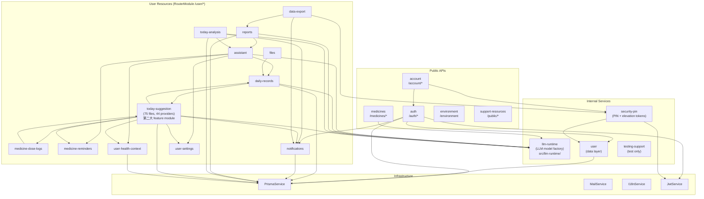
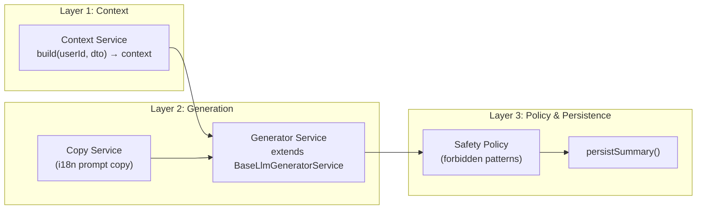
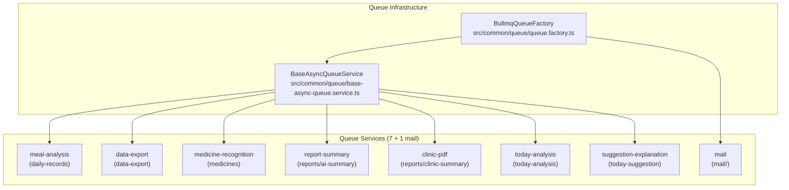

# Lucent Architecture

## Module Dependency Graph



## AI Pipeline Architecture

All AI analysis modules follow a three-layer pattern:



### Implementations

- ReportsAiSummary
  - Context: ReportsAiSummaryContextService
  - Generator: ReportsAiSummaryGeneratorService
  - Model Role: `analysis`
- TodayAnalysis
  - Context: TodayAnalysisContextService
  - Generator: TodayAnalysisGeneratorService
  - Model Role: `analysis`
- DailyRecordCandidates
  - Context: (inline in service)
  - Generator: DailyRecordCandidatesGeneratorService
  - Model Role: `language`
- Assistant
  - Context: (chat-based, different architecture)
  - Generator: —
  - Model Role: `chat`

## Directory Structure Convention

See `AGENTS.md` → Module Subdirectory Whitelist for the complete governance rules.

Root-level `src/` infrastructure directories stay separate from `common/` shared code. In
particular, `mail/`, `prisma/`, `config/`, and `i18n/` remain root-level runtime boundaries, while
`common/` is internally split by role:

- `common/helpers/` — pure helper functions and stateless shared utilities
- `common/services/` — shared injectable services
- `common/logger/` — shared Nest logging module
- `common/llm/`, `common/filters/`, `common/interceptors/`, `common/middleware/`,
  `common/constants/`, `common/validators/`, `common/queue/`, `common/metrics/`,
  `common/events/`, `common/storage/`, `common/types/` — capability-specific shared code

```
src/modules/{module}/
├── dto/               # Data Transfer Objects (must have index.ts)
│   └── index.ts       # Barrel export
├── services/          # All business-logic services
│   ├── {module}.service.ts
│   ├── {module}-mapper.service.ts  # Mapper convention
│   └── ownership.service.ts        # Ownership verification convention
├── guards/            # NestJS Guards (only .guard.ts, CanActivate)
├── types/             # Module-level TypeScript types
├── constants/         # Module-level constants
├── prompts/           # AI prompt copy and templates
├── schemas/           # AI output schemas and structured-response validators
├── config/            # Module-level runtime configuration (objects/classes only)
├── {module}.controller.ts
└── {module}.module.ts
```

## API Route Architecture

Routes are configured via `RouterModule` in `AppModule`. Controllers declare bare resource paths;
the prefix is centralized.

- `/auth/*`
  - Modules: auth
  - Via: Controller `@Controller('auth')`
- `/account/*`
  - Modules: account
  - Via: Controller `@Controller('account')`
- `/medicines/*`
  - Modules: medicines
  - Via: Controller `@Controller('medicines')`
- `/environment`
  - Modules: environment
  - Via: Controller `@Controller('environment')`
- `/public/*`
  - Modules: support-resources
  - Via: Controller `@Controller('public')`
- `/testing/*`
  - Modules: testing-support
  - Via: Controller `@Controller('testing/fullstack-e2e')`
- `/user/*`
  - Modules: assistant, daily-records, data-export, files, health-context, medicine-dose-logs,
    medicine-reminders, notifications, reports, settings, today-analysis
  - Via: `RouterModule.register()`

## Error Handling

All error responses use `api-errors.ts` helpers (`notFound`, `badRequest`, `unauthorized`,
`forbidden`, `conflict`) with i18n keys. The global envelope is `{ code: ResultCode, message:
string, data?: T }`. `ApiExceptionFilter` is now resolved from Nest DI instead
of being `new`-ed in bootstrap code so it can emit structured Winston logs
with `requestId`, method, path, status, and stack metadata.

## Logging Foundation

- `src/common/logger/logger.module.ts` registers the app-wide `nest-winston`
  logger.
- `src/common/middleware/request-id.middleware.ts` remains the request-id
  source of truth and mirrors the final id back to `X-Request-Id`.
- `src/common/logger/request-context.service.ts` stores the active request id in
  AsyncLocalStorage so shared infrastructure can read request context without
  threading `Request` through every call.
- `setup-app.ts` no longer hand-builds string HTTP logs; request/response
  logging is handled by Winston with route-level noise suppression for
  health/docs endpoints. Each log line includes response time (e.g.
  `completed 200 in 42ms`).
- `SlowRequestInterceptor` (`src/common/interceptors/slow-request.interceptor.ts`)
  is a global interceptor that warns when a request exceeds
  `SLOW_REQUEST_THRESHOLD_MS` (default 2000ms). Use `@SkipSlowRequestLog()` to
  opt out per-handler.
- `LifecycleService` (`src/common/logger/lifecycle.service.ts`) logs structured
  startup and shutdown events. `main.ts` calls `app.enableShutdownHooks()` so
  SIGTERM/SIGINT triggers NestJS lifecycle hooks (Prisma disconnect, etc.).

## Metrics Foundation

- `src/common/metrics/metrics.module.ts` is a Global module that provides
  `MetricsService` — the centralised Prometheus metrics registry.
- `MetricsService` (`src/common/metrics/metrics.service.ts`) collects:
  - Default Node.js runtime metrics via `prom-client` `collectDefaultMetrics`
    (heap, rss, event loop lag, GC stats, active handles)
  - HTTP request latency histogram and counter
    (`http_request_duration_seconds`, `http_requests_total`)
  - BullMQ job counter and gauges
    (`bullmq_jobs_total`, `bullmq_active_jobs`, `bullmq_waiting_jobs`)
  - LLM call duration histogram and token counter
    (`llm_call_duration_seconds`, `llm_tokens_used_total`)
- The `/metrics` endpoint is served as a raw Express route in `setupApp`,
  not a NestJS controller, so it bypasses the interceptor/filter stack.
- The metrics middleware (`src/common/metrics/metrics.middleware.ts`) uses
  `res.on('finish')` to capture the final HTTP status code. Route paths are
  normalised (UUIDs and numeric IDs → `:id`) to prevent label cardinality
  explosion.
- `METRICS_ENABLED` env var controls activation (default `true`, forced off in
  test environment). See ADR-0006 for the full observability strategy.

## Queue Topology

All BullMQ queues share a single Redis connection managed by `BullmqQueueFactory`
(`src/common/queue/queue.factory.ts`). Each queue has an `enqueue` endpoint
(POST `/async`) and a `getStatus` polling endpoint (GET `/status/:jobId`).
`BaseAsyncQueueService` (`src/common/queue/base-async-queue.service.ts`) provides
the shared enqueue/poll/cache lifecycle; subclasses implement `executeJob`.



### Queue Service Details

| Queue                  | Module                 | Concurrency | Result TTL | Notes                                  |
| ---------------------- | ---------------------- | ----------- | ---------- | -------------------------------------- |
| meal-analysis          | daily-records          | 1           | 30 min     | Image → LLM vision analysis            |
| data-export            | data-export            | 1           | 30 min     | Dashboard PDF generation               |
| medicine-recognition   | medicines              | 1           | 30 min     | Image → LLM medicine recognition       |
| report-summary         | reports/ai-summary     | 1           | 30 min     | LLM dashboard summary                  |
| clinic-pdf             | reports/clinic-summary | 1           | 30 min     | Clinic PDF with LLM summary            |
| today-analysis         | today-analysis         | 1           | 30 min     | LLM today analysis + SSE stream        |
| suggestion-explanation | today-suggestion       | 1           | 30 min     | LLM suggestion explanation             |
| mail                   | mail                   | 3           | —          | Transactional email (no async polling) |

When Redis is unavailable, `BullmqQueueFactory` degrades to synchronous execution
(the job processor runs inline, results cached in cache-manager).

## Security Elevation

Sensitive routes are protected by `SecurityElevationGuard` plus the `@RequireSecurityElevation()`
decorator. Elevation is granted by a short-lived signed JWT minted after verifying the user's
6-digit Security PIN. The guard reads the token from the `x-security-elevation` header as `Bearer
<token>` and stores the decoded payload on the request as `securityElevation`. Any PIN
enable/change/disable operation increments the user's `securityElevationVersion`, invalidating
prior elevation tokens.

## Database

- **ORM**: Prisma 7 (client provider: `prisma-client`)
- **Schema**: `prisma/schema.prisma`
- **Generated client**: `src/generated/prisma/`
- **Key conventions**: `@map()` for snake_case columns, `@db.Timestamptz(3)` for timestamps,
  soft-delete via `deletedAt`

## Assistant RAG Data-Source Constraints

以下约束记录了 Assistant 三源检索架构的刻意设计边界，任何修改前必须理解：

- **源分离**：中文说明书（`leaflet_embeddings`）、DrugBank 科学文献（`drugbank_passage_embeddings`）、
  医学问答语料（`medical_qa_embeddings`）各自独立向量表 + 独立检索工具。不得合并为一个共享语料库
  或通用检索工具。
- **医学 QA 仅限 Assistant**：医学问答语料的检索结果仅供 Assistant 对话使用。前端线性服药流程
  （如 medication flows、daily records 展示）不得消费该语料的检索结果。放宽此限制需要单独的法律/
  产品决策。
- **无 CN→DrugBank 运行时映射表**：跨语言药品关联不通过运行时表或别名映射实现；跨源问题时使用
  Assistant 源分离结构化查找工具，而非建立共享映射层。
