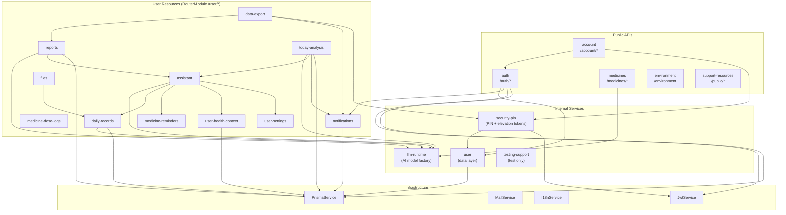

# Lucent Architecture

## Module Dependency Graph



## AI Pipeline Architecture

All AI analysis modules follow a three-layer pattern:


### Implementations

- ReportsAiSummary
  - Context: ReportsAiSummaryContextService
  - Generator: ReportsAiSummaryGeneratorService
  - Model Role: `analysis`
- TodayAnalysis
  - Context: TodayAnalysisContextService
  - Generator: TodayAnalysisGeneratorService
  - Model Role: `analysis`
- DailyRecordCandidates
  - Context: (inline in service)
  - Generator: DailyRecordCandidatesGeneratorService
  - Model Role: `language`
- Assistant
  - Context: (chat-based, different architecture)
  - Generator: —
  - Model Role: `chat`

## Directory Structure Convention

See `AGENTS.md` → Module Subdirectory Whitelist for the complete governance rules.

Root-level `src/` infrastructure directories stay separate from `common/` shared code. In
particular, `mail/`, `prisma/`, `config/`, and `i18n/` remain root-level runtime boundaries, while
`common/` is internally split by role:

- `common/helpers/` — pure helper functions and stateless shared utilities
- `common/services/` — shared injectable services
- `common/logger/` — shared Nest logging module
- `common/ai/`, `common/filters/`, `common/interceptors/`, `common/middleware/`,
  `common/constants/`, `common/validators/` — capability-specific shared code

```
src/modules/{module}/
├── dto/               # Data Transfer Objects (must have index.ts)
│   └── index.ts       # Barrel export
├── services/          # All business-logic services
│   ├── {module}.service.ts
│   ├── {module}-mapper.service.ts  # Mapper convention
│   └── ownership.service.ts        # Ownership verification convention
├── guards/            # NestJS Guards (only .guard.ts, CanActivate)
├── types/             # Module-level TypeScript types
├── constants/         # Module-level constants
├── prompts/           # AI prompt copy and templates
├── schemas/           # AI output schemas and structured-response validators
├── config/            # Module-level runtime configuration (objects/classes only)
├── {module}.controller.ts
└── {module}.module.ts
```

## API Route Architecture

Routes are configured via `RouterModule` in `AppModule`. Controllers declare bare resource paths;
the prefix is centralized.

- `/auth/*`
  - Modules: auth
  - Via: Controller `@Controller('auth')`
- `/account/*`
  - Modules: account
  - Via: Controller `@Controller('account')`
- `/medicines/*`
  - Modules: medicines
  - Via: Controller `@Controller('medicines')`
- `/environment`
  - Modules: environment
  - Via: Controller `@Controller('environment')`
- `/public/*`
  - Modules: support-resources
  - Via: Controller `@Controller('public')`
- `/testing/*`
  - Modules: testing-support
  - Via: Controller `@Controller('testing/fullstack-e2e')`
- `/user/*`
  - Modules: assistant, daily-records, data-export, files, health-context, medicine-dose-logs,
    medicine-reminders, notifications, reports, settings, today-analysis
  - Via: `RouterModule.register()`

## Error Handling

All error responses use `api-errors.ts` helpers (`notFound`, `badRequest`, `unauthorized`,
`forbidden`, `conflict`) with i18n keys. The global envelope is `{ code: ResultCode, message:
string, data?: T }`. `ApiExceptionFilter` is now resolved from Nest DI instead
of being `new`-ed in bootstrap code so it can emit structured `pino` logs with
`requestId`, method, path, status, and stack metadata.

## Logging Foundation

- `src/common/logger/logger.module.ts` registers the app-wide `nestjs-pino`
  logger.
- `src/common/middleware/request-id.middleware.ts` remains the request-id
  source of truth and mirrors the final id back to `X-Request-Id`.
- `src/common/logger/request-context.service.ts` stores the active request id in
  AsyncLocalStorage so shared infrastructure can read request context without
  threading `Request` through every call.
- `setup-app.ts` no longer hand-builds string HTTP logs; request/response logs
  come from `pino-http` with route-level noise suppression for health/docs
  endpoints.

## Security Elevation

Sensitive routes are protected by `SecurityElevationGuard` plus the `@RequireSecurityElevation()`
decorator. Elevation is granted by a short-lived signed JWT minted after verifying the user's
6-digit Security PIN. The guard reads the token from the `x-security-elevation` header as `Bearer
<token>` and stores the decoded payload on the request as `securityElevation`. Any PIN
enable/change/disable operation increments the user's `securityElevationVersion`, invalidating
prior elevation tokens.

## Database

- **ORM**: Prisma 7 (client provider: `prisma-client`)
- **Schema**: `prisma/schema.prisma`
- **Generated client**: `src/generated/prisma/`
- **Key conventions**: `@map()` for snake_case columns, `@db.Timestamptz(3)` for timestamps,
  soft-delete via `deletedAt`
